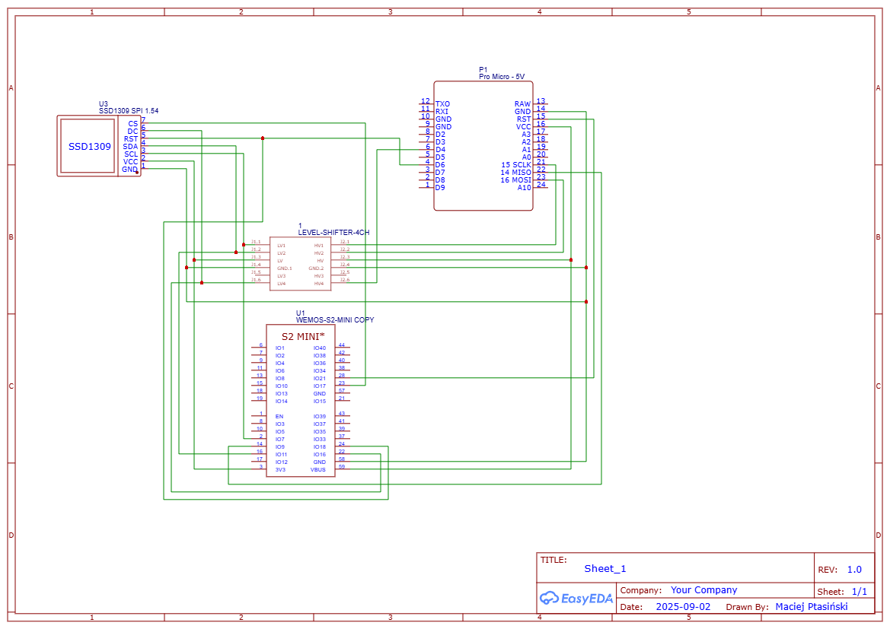

# Arduboy FX WiFi

Console build around ardbuboy classic hardware - AVR 32u4 - with an ESP32 as a WiFi coprocessor.

Main goal is to connect the esp to the Arduboy via SPI, and be able to upload games wirelessly.

## Hardware

- AVR - proMicro 5V 16MHz
- ESP32 - Wemos s2 mini
- 128x64 OLED - SSD1306 (SPI)
- sd card - microSD breakout board

## Wiring

